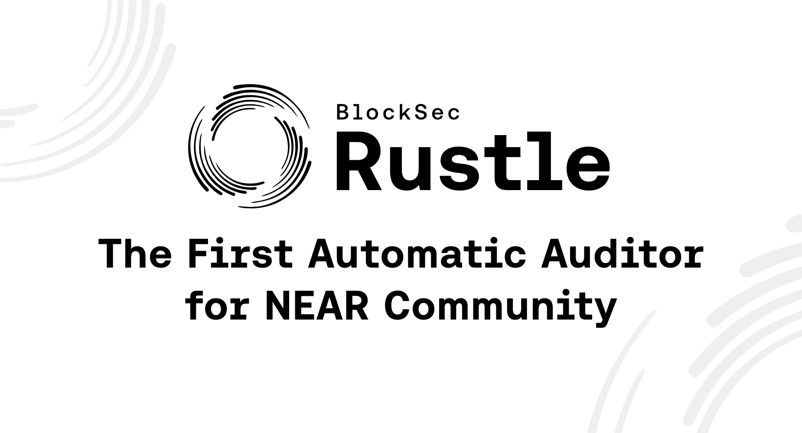

# Rustle



[](https://github.com/blocksecteam/rustle/actions/workflows/ci.yml)
[](https://github.com/blocksecteam/rustle/actions/workflows/build-image.yml)
[](LICENSE)
[](https://awesomenear.com/rustle)
[](https://devpost.com/software/rustle)

Rustle is an automatic static analyzer for NEAR smart contracts in Rust. It can help to locate tens of different vulnerabilities in NEAR smart contracts.
According to [DefiLlama](https://defillama.com/chain/Near), among the top 10 DApps in NEAR, 8 are audited by BlockSec. With rich audit experience and a deep understanding of NEAR protocol, we build this tool and share it with the community.

## Get started

### Prerequisite

#### Linux setup

Install the required toolkits with the following commands for **Rustle** in Linux. Commands are tested in Ubuntu 20.04 LTS.

```bash
# install Rust Toolchain
curl --proto '=https' --tlsv1.2 -sSf https://sh.rustup.rs | sh

# install LLVM 15
sudo bash -c "$(wget -O - https://apt.llvm.org/llvm.sh)" 15

# install Python toolchain
sudo apt install python3 python3-pip    # requires python >= 3.8
pip3 install -r utils/requirements.txt  # you need to clone this repo first

# add WASM target
rustup target add wasm32-unknown-unknown

# install other components
sudo apt install figlet
cargo install rustfilt

# [optional] useful tools for developing
LLVM_VERSION=
sudo apt install clangd-$LLVM_VERSION clang-format-$LLVM_VERSION clang-tidy-$LLVM_VERSION
```

#### macOS setup

The following commands are for users using macOS, they are tested only on Apple Silicon Mac, so use them with caution.

```bash
# install Rust Toolchain
curl --proto '=https' --tlsv1.2 -sSf https://sh.rustup.rs | sh

# install LLVM 15
brew install llvm@15

# install Python packages
pip3 install -r utils/requirements.txt  # you need to clone this repo first
                                        # using macOS default python3

# add WASM target
rustup target add wasm32-unknown-unknown

# install other components
brew install figlet coreutils gsed
cargo install rustfilt
```

#### Docker

We provide a docker solution.

```bash
# build the image
docker build --build-arg UID=`id -u` --build-arg GID=`id -g` -t rustle .

# run a container from the image
docker run --name rustle -it -v `pwd`:/rustle -w /rustle rustle bash

# exec the container
docker start rustle
docker exec -it -w /rustle rustle bash
```
